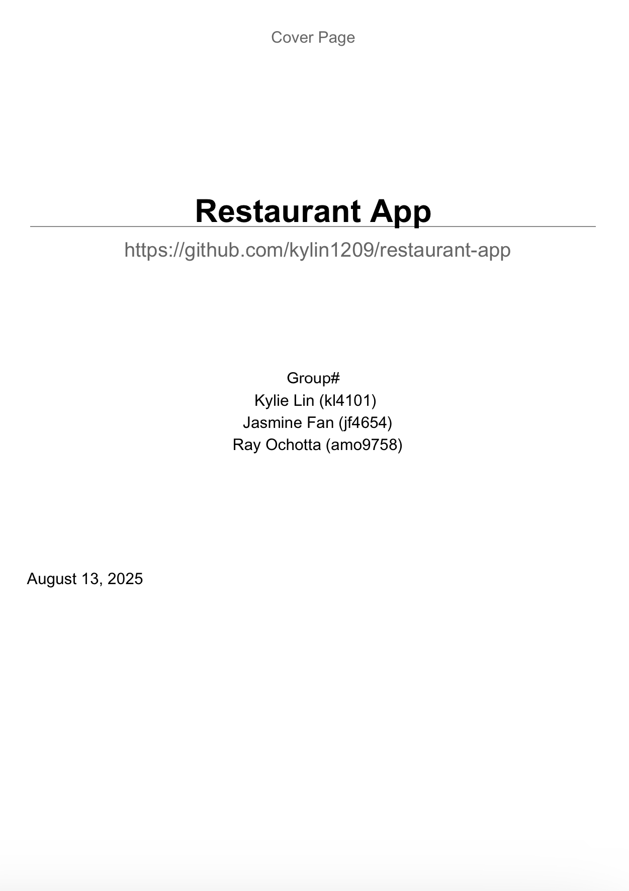
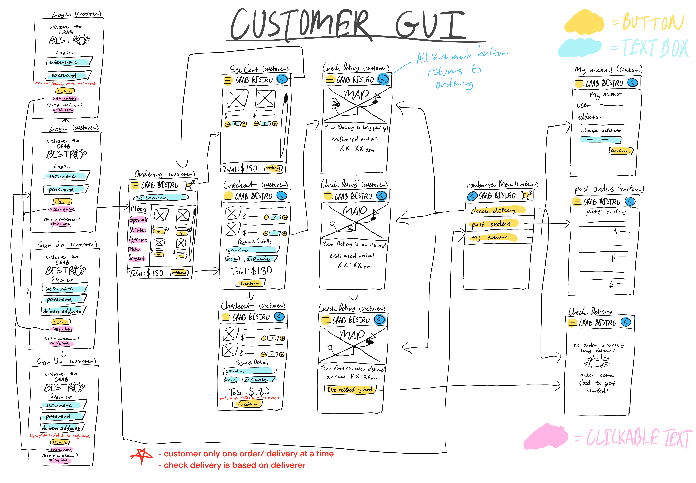
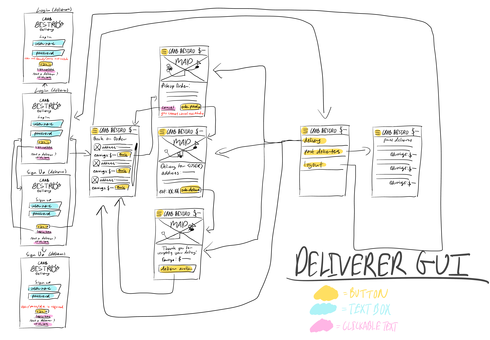

# Restaurant Delivery App
> Please use VS Code to run our app.

## Team Members
- Kylie Lin: [kylin1209](https://github.com/kylin1209)
- Jasmine Fan: [jasmine7310](https://github.com/jasmine7310)
- Ray Ochotta: [SnowyOchole](https://github.com/SnowyOchole)

# Project Description
Restaurant application is an app for a fictional restaurant with two interfaces: one for customers to order menu items from a fictional restaurant and another for deliverers to deliver said orders.

 

  
Desciption Continued Here

    
    After logging in, Customers can view the menu and choose to add menu items to their cart, where they can then access from buttons on the top of the GUI. From the cart view, customers can then order their food and receive a confirmation. There will also be a hamburger menu to view their past orders and delivery status. Customers can also track the status of their order upon checkout. 

    After logging in, Deliverers can view a suite of different orders yet to be delivered. They can choose to “book” an order, deeming it their responsibility. They have to confirm that they will be responsible for said order through another page with the order details. After reserving the order, the Deliverer can deem it delivered through another button. A hamburger menu will also allow deliverers to view their past deliveries and log out.
  

# Project Report
Please click on the preview below for the full PDF.

# Project Ideation

